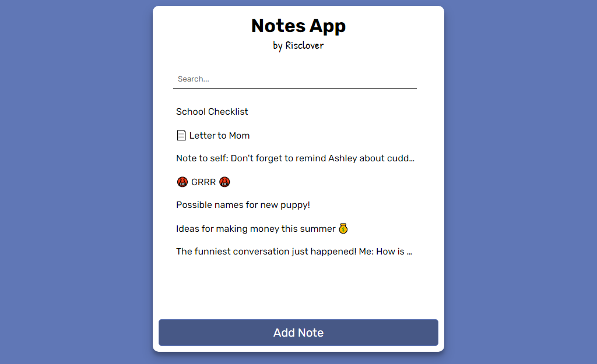

# Notes App

### Table of Contents

1. [Introduction](#introduction)
2. [How to Use](#how-to-use)
3. [Build](#build)
4. [Links](#links)

## Introduction

Notes App is a simple and easy-to-use browser-based notes app for your basic note-taking needs. Comes with the ability to add, edit, delete, and search for notes. Users are allowed to save notes without including a title (but body text MUST be included).

## How to Use

### Adding a Note

1. Click the big button at the bottom of the app, 'Add Note'.
2. (optional) Write a title where the 'Title' placeholder is.
3. Write your note(s).
4. Click 'Save Note', which will save your note and bring you back to the home screen with your note in the menu.

### Deleting a Note

- Hover over your note in the menu. You'll see a trash can appear on the right side. Click this to delete the note.

### Editing a Note

- Click on a note to read it. You are also allowed to edit notes from this screen.

### Searching for a Note

- Use the searchbar at the top of the app. The moment you start typing in the searchbar, the list will begin to filter out unrelated results.
- You can search for terms found in both titles AND note bodies.

## Build

This app was built using the following languages, libraries, and frameworks:

- HTML
- CSS
- JavaScript
- React

## Links

- [Live site](https://risclover.github.io/notes-app)
- [Author website/portfolio](https://risclover.github.io/)
